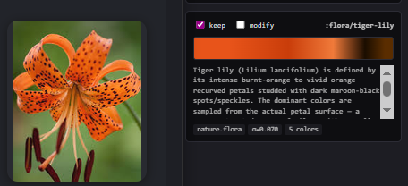
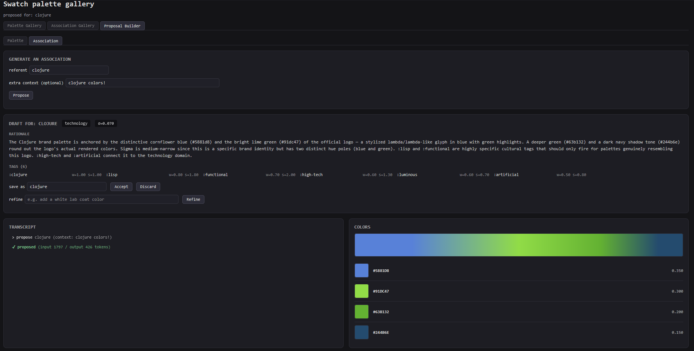
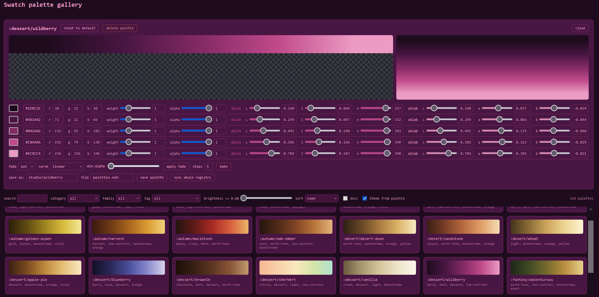
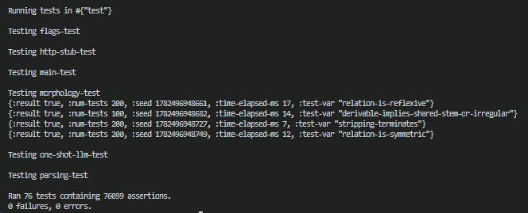

# 🎨 Clj-Colors (AKA "Swatch")

<table>
<tr>
<td width="60%">

Swatch is a color set management and query library for Clojure, among other things. 

It includes powerful and easy to set up LLM integration at the REPL, just set an environment variable for a session:

`(alter-var-root #'clj-colors.llm.core/*api-key* (constantly "sk-ant-api....rest-of-your-key"))`

</td>
<td width="40%">



</td>
</tr>
</table>

...and then you will be able to generate and manage color sets easily (and inexpensively - approximately ¢1/llm call in my experience using claude sonnet 4.6; newer models do provide slightly better accuracy in my limited testing, for not too much greater a cost - but I found sonnet 4.6 to be perfectly suitable to this task) generate custom palettes for use and reuse.

This library also provides a basic curated collection of palettes and associations (as well as a fairly robust color tag base), a browser-based studio for creating and editing them, and, importantly, an API for access and generation of color combinations and gradients by visual characteristics, theme, and semantic tags.

Swatches/palettes are named sets of colors, stored as hex or rgba and enriched on load with computed metadata so you can query them by 'family', 'tag', 'temperature', 'brightness', and more. The main difference between a palette and a swatch, is that to be considered a 'swatch', a palette would need to be accompanied by the appropriate metadata.

While it might be hard to keep track of so many palettes for us as humans, the tagging system is intended (albeit still in early development) for use in LLM workflows, where textual input from user requests may map onto a number of these palettes and thus be accessed as a tool call via the api.

Swatch can also generate SVG gradients, transparency fades, and other color assets directly from palette definitions; allowing palettes to move seamlessly from data to design.

Add this to your clojure project in deps.edn with:
`com.github.thefakelorlyons/clj-colors {:mvn/version "0.2.10"}`

## The data model

Swatch utilizes three related concepts that build on one another:

1. **Colors** describe individual colors.
2. **Associations** represent a concrete, single, idea using multiple colors.
3. **Palettes** describe broader themes and are optionally composed of sets of associations.

### Colors

A color is the atomic unit of the system and may carry many interpretations depending on context.

For example:
- `#5881D8`
- cornflower blue
- periwinkle
- Clojure blue
- clear sky
- cool technology

One color can express **many** ideas.
Color tags, however, are weighed far less *heavily* in the system, as they are more broadly applicable to differing inheriting palettes.

---

### Associations

An association is a palette (a set of colors, and corresponding distributions) with a single meaning.

Examples:
- `:flora/sunflower`
- `:mineral/obsidian`
- `:technology/clojure`
- `:weather/golden-hour`

Associations are intended to behave almost like visual "memes": a recognizable arrangement of colors that evokes one specific referent.

An association contains multiple colors, but it represents exactly one thing.

For example, `:technology/clojure` represents the Clojure language and its logo colors, while `:flora/sunflower` represents the characteristic yellows, browns, and greens of a sunflower (and their respective relative weights/distribution).


---

### Palettes

Palettes occupy the most abstract level of the model.

A palette:
- contains multiple colors,
- possess their own tags,
- may be composed of multiple associations,
- can inherit meaning (via tags) from those associations (based on similarity scores).

A palette might simultaneously evoke:
- `:weather/golden-hour`
- `:flora/sunflower`
- `:technology/clojure`

This allows palettes to accumulate multiple interpretations instead of being tied to a single referent.

---

## One color, one meaning, many meanings

| Layer | Colors | Meanings |
|------|---------:|---------:|
| **Color** | 1 | many |
| **Association** | many | 1 |
| **Palette** | many | many |

This is the core distinction, stated another way:

- **Colors:** one color, many interpretations.
- **Associations:** many colors, one interpretation.
- **Palettes:** many colors, many interpretations.

---

## Shared structure

| Feature | Colors | Associations | Palettes |
|--------|:-------:|:------------:|:--------:|
| Has tags | ✓ | ✓ | ✓ |
| Represents a unqiue 'referent' |  | ✓ |  |
| Contains multiple colors |  | ✓ | ✓ |
| Carries association tags |  |  | ✓ |

---

## Storage

| Layer | Canonical data | User extensions | Notes |
|------|----------------|----------------|-------|
| Colors | `color_tags.edn` | `n/a` | `(not extensible at this time [without tinkering yourself])` <br> `...(although you can definitely add your own to color_tags.edn but it is not necessarily recommended)` |
| Associations | `associations.edn` | `resources/extensions/associations/` | `n/a` |
| Palettes | `palettes.edn` | `resources/extensions/palettes/` | `n/a` |

## Metadata

```clojure
:mineral/obsidian
{:colors {"#0a0a0c" 0.35
          "#1a1015" 0.25
          "#100a0d" 0.15
          "#0d0712" 0.15
          "#241827" 0.10}
 :tags {:obsidian {:weight 1.0}
        :volcanic-glass {:weight 1.0}
        :archaeological {:weight 0.7 :specificity 1.8}
        :iridescent-dark {:weight 0.8 :specificity 0.9}
        :silicate {:weight 0.6 :specificity 1.3}
        :black-rich {:weight 0.9 :specificity 0.6}}
 :sigma 0.04
 :category :mineral
 :rationale "Obsidian is near-black volcanic glass with subtle
 iridescent purple-and-grey undertones from light interference at
 conchoidal fractures. Tight sigma because the color signature is
 narrow. :archaeological is highly specific (only fires for palettes
 that genuinely resemble obsidian, not all dark palettes)."
 :source :authored}
```

Associations are evaluated against every palette in the registry at refresh time. A palette that closely matches an association's color distribution inherits that association, and the association's tags, as part of its computed `:attributes`.

This means two important things:

- **Reverse lookup**: a palette will tell you which named referents it resembles. `:forest/jungle` might score 0.27 on `:earth/forest-floor` (high enough to register) and 0.04 on `:mineral/obsidian` (filtered out).
- **Tag emergence**: a palette that looks like beeswax inherits `:golden`, `:natural`, `:amber` from the beeswax association, even if the palette's own author never wrote those tags.

The `:sigma` field controls breadth: tight (0.04) for a single material's color, broad (0.15) for an atmospheric range. The `:specificity` per tag controls how strongly a palette must match before that tag fires, so `:archaeological` only attaches to palettes that genuinely look like obsidian, not all dark palettes.

This is the metadata layer that makes palettes discoverable through meaning, not just naming (hopefully).

Each loaded swatch carries derived fields alongside its colors:
```clojure
{:family            :green ; Derived based off of the rbga values when the palette is generated.
 :brightness        0.39   ; Mean values across the palette...
 :temperature       0.491  ; Using the mean provides a general idea of which palettes
 :saturation        0.604  ;   are 'mildly' vs 'highly' saturated, hot, tinted, etc.
 :contrast          0.937
 :mean-lightness    0.46
 :hue-concentration 0.97
 :count             5      ; The number of 'stops'/hues in the gradient. Currently this has a max of 12 (arbitrarily).
 :name              :alien-jungle
 :category          :forest
 :tags              #{"green" "vivid" "neon" "high-contrast" "alien" "organic"}}
```

## Data
A swatch is stored as its hex & rgba colors plus optional tags:
```clojure
; Examples are drawn from resources/palettes.edn
; Example 1:
 :forest/jungle
 {:hex ["#0C1A12" "#183A26" "#2A623E" "#4C9660" "#C2ECBC"]
  :rgba [[12 26 18 255] [24 58 38 255] [42 98 62 255] [76 150 96 255] [194 236 188 255]]
  :weights [0.3 0.2 0.2 0.1 0.2]; Optional, even distribution assumed if unspecified.
  :count 5
  :name :jungle
  :category :forest
  :family :green
  :brightness 0.226
  :temperature 0.479
  :saturation 0.414
  :contrast 0.742
  :mean-lightness 0.357
  :hue-concentration 0.972
  :tags #{"earth-tone" "green" "monochrome"}}

; Example 2:
 :ocean/abyss
 {:hex ["#05101F" "#0A2038" "#123A5C" "#1E6088" "#4C9CC0" "#A8DCEC"]
  :rgba [[5 16 31 255] [10 32 56 255] [18 58 92 255] [30 96 136 255] [76 156 192 255] [168 220 236 255]]
  :count 6
  :name :abyss
  :category :ocean
  :family :blue
  :brightness 0.185
  :temperature 0.358
  :saturation 0.642
  :contrast 0.651
  :mean-lightness 0.343
  :hue-concentration 0.992
  :tags #{"blue" "dark" "deep" "low-contrast" "monochrome" "vivid"}}
```

##  Examples of useage are included in scratch.clj!
### Below is a small snippet as a quick snapshot
#### *Note: There is far more functionality in this library than shown here or in scratch. Hopefully video tutorials can follow this video soon.*:

```clojure
(require '[clj-colors.main :as main]
         '[clj-colors.access :as access])

(main/get-palette :forest/jungle)   ;; by full key
(main/get-palette :jungle)          ;; or by bare name

(main/palette-keys)
(main/categories)
(keys (main/palettes-in-category :ocean))

(keys (main/palettes-with-tag "vivid"))
(keys (main/palettes-with-tags "retro" "80s"))
(keys (main/palettes-by #(> (:brightness %) 0.45)))

(main/random-palette)               ;; [key palette]
(main/random-palette "water")       ;; restricted to a tag
(main/random-color :synthwave/synthwave)

; Also works  
(access/get-orange-palettes)
(keys (access/get-orange-palettes))
(access/get-category-palettes :sunset)
(keys (access/get-category-palettes :sunset))
```

### Families & Categories

- `:family` is the dominant perceived _color family_ derived from the palette's hues.
- `:category` is the thematic collection a palette belongs to and forms the namespace prefix of its id.
  - _Categories are primarily organizational and curated by the palette author._

```clojure
 :green
 :blue
 :teal
 :orange
 :purple
 :red
; ^^^
; color-families

 :forest/jungle
; ^^^^^^  ^^^^
; catgry  name

; Examples of some default categories (contained in `resources/palettes.edn`):

:forest
:ocean
:space
:synthwave
:sunset
:volcanic
; ... and more!

```

### Tags

Tags are descriptive labels used for discovery, filtering, and semantic search.

Some tags are generated automatically from palette statistics:
```
"dark"
"light",
"vivid",
"muted",
"pastel",
"neon",
"monochrome",
"grayscale",
"earth-tone",
"high-contrast",
"low-contrast"
```

These built-in tags are intended as a useful baseline, not a complete vocabulary.

*Palette authors are encouraged to add their own tags to capture themes, moods, use-cases, aesthetics, cultural references, or any other concepts that might help identify a palette later.*

Examples:
```
#{"organic" "alien" "jungle" "bioluminescent"}
#{"retro" "80s" "arcade" "synthwave"}
#{"stormy" "deep" "oceanic" "cold"}
#{"warm" "cozy" "autumn" "harvest"}
```
There is no fixed tag taxonomy; the library deliberately allows arbitrary descriptors because semantic richness makes palettes easier to discover and reuse.

A palette with twenty meaningful tags is often more useful than one with only a handful of color-derived labels.

This becomes particularly valuable in generative and AI-assisted workflows, where natural language requests can be mapped onto palette metadata:

- "Give me something dark, organic, and slightly alien."
- "Find a warm retro palette with high contrast."
- "Pick a dreamy pastel palette for a spring scene."

The more descriptive metadata attached to a palette, the more effectively it can participate in search, recommendation, procedural generation, and LLM-driven selection.

## Gallery & studio


A live, browser-based gallery served straight from the library, no build step:

```clojure
(require '[clj-colors.gallery :as gallery])
(gallery/serve!)   ;; http://localhost:8350, opens a browser
```

Filter by category, family, tag, or brightness; click a palette to open the
studio, where you can edit colors, weights, alphas, and fades, then save the
design back to the registry and the palettes file (surgically) or delete it.
The page chrome themes itself from the palette you're editing. Works from any
project that depends on clj-colors.

## SVG export

```clojure
(require '[clj-colors.svg :as svg])

;; smooth gradient on a rectangle as an svg
(svg/spit-svg "out.svg"
  (main/palette-gradient-svg :ocean/abyss {:width 400 :height 600}))

;; discrete blocks
(main/palette-main-svg :forest/fern {:width 600 :height 120})

;; straight from arbitrary colors
(svg/gradient-svg ["#102030" "#4080C0" "#E0F0FF"] {:orientation :horizontal})
```

Output is a plain SVG string with no dependencies.

## Layout

```
deps.edn                          - dependencies
resources/
  palettes.edn                    - canonical palette data
  authored.edn                    - canonical hand-authored associations
  color_tags_base.edn             - hand-curated color → tag mappings
  color_tags.edn                  - OKLAB-smoothed expansion of the base
  associations_base_1.edn         - canonical seed associations
  extensions/
    associations/                 - drop-in user associations (default + custom)
    palettes/                     - drop-in user palettes (default + custom)
  gallery/
    gallery.cljs                  - shared state, tabs, theming, app mount
    palette_manager.cljs          - palette grid + studio screen
    association_manager.cljs      - association grid + studio screen
    proposal_gui.cljs             - LLM-driven proposal builder
    gallery_styles.css            - styling shared across screens
src/clj_colors/
  main.clj                        - palette registry, query, persistence
  color.clj                       - hex <-> rgba <-> oklab/oklch conversion
  meta.clj                        - color-derived metadata
  associations.clj                - association resolution, palette matching
  authoring.clj                   - association CRUD + on-disk format
  color_tags.clj                  - ingested tag corpus
  compatibility.clj               - category-compatibility tensor
  svg.clj                         - gradient and block SVG rendering
  app/                            - browser gallery server
    gallery.clj                     page shell + lifecycle
    server.clj                      HTTP routing primitives
    palette_manager.clj             palette endpoints + catalog
    association_manager.clj         association endpoints + catalog
    proposal.clj                    LLM proposal endpoints
    color_ops.clj                   color math endpoints
  llm/                            - Anthropic API integration
    core.clj                        request layer, EDN parsing
    draft.clj                       draft staging primitives
    associative.clj                 association proposals + refine
    palettes.clj                    palette proposals + refine
    batch.clj                       brainstorm + batch helpers
  ingest/                         - bulk ingestion of color-tag corpora
test/                             - tests
test-resources/                   - test data
```

Each extensions/ subdirectory ships with one or more default .edn files to get you started. Feel free to delete, edit, or add new files alongside them. Anything dropped into these directories is loaded automatically at registry refresh.

## Adding palettes and associations

There are three built-in methods of writing to the same registry files.

### From the Proposal Builder (recommended, for LLM-assisted authoring)

The Proposal Builder tab handles four authoring scales:

- **Single proposal**: type a referent, get a color-with-rationale card to review
- **Palette with seed colors**: anchor the LLM around hex codes you already like
- **Modify existing**: load any registered entry and refine via natural language
- **Batch**: paste a list of referents in any of five accepted formats, watch each card stream in with live progress and per-entry cost tracking, accept the kept set in one click

Batch results render as a grid of preview cards. Check or uncheck **keep**, toggle **modify** to refine an individual entry inline, then hit **Accept N** to commit. Discarded entries are dropped without writing.

### From the browser studio (mostly for viewing, modifications, and hand-authoring)

Open the gallery and use **Palette Gallery → + new palette** or **Association Gallery → + new association**. The studio gives you live OKLCH and OKLAB controls, weight sliders, alpha, tag editing, and a save-back button that surgically updates the relevant `.edn` file (leaving comments, formatting, and unrelated entries untouched). Delete a palette by opening its studio and clicking the trash icon.

Both flows write to the same canonical files (`palettes.edn`, `authored.edn`) or to whichever `extensions/` file the entry was registered against: preserving comments, ordering, and hand-kept formatting.

### From the REPL (for scripted or programmatic workflows)

```clojure
;; Palettes
(main/register-palette! :forest/swamp
  ["#0A140C" "#1C3220" "#3E5E38" "#6E9A52" "#C4E29A"]
  {:tags ["murky"]})

(main/unregister-palette! :forest/swamp)

;; Associations
(require '[clj-colors.authoring :as authoring])

(authoring/register-association! :mineral/jet
  {:colors   {"#1a1a1a" 0.4 "#2a2025" 0.3 "#0d0d0d" 0.3}
   :tags     {:jet       {:weight 1.0}
              :lignite   {:weight 0.7 :specificity 1.4}
              :victorian {:weight 0.6 :specificity 1.8}}
   :sigma    0.04
   :category :mineral
   :rationale "Fossilized wood, polished black with brown undertones."})

(authoring/unregister-association! :mineral/jet)
```

Colors may be hex strings or `[r g b]` / `[r g b a]` vectors. Write the current registry back to canonical EDN at any time:

```clojure
(main/save-registry! "resources/palettes.edn")
(authoring/save-registry! "resources/authored.edn")
```

Or edit the EDN file directly and call `(main/reset-registry!)`.

### Bulk drop-in from another project

Anything in `resources/extensions/palettes/` or `resources/extensions/associations/` loads automatically. Drop a curated `.edn` bundle in either directory and the entries appear in the gallery on next reload. Share bundles by checking them into a repo, gisting them, or attaching to a PR. There's no registration step beyond placing the file.

## A note on persistence:

This program assumes that users want to develop their own libraries of color palettes that span far beyond the defaults provided here. This note contained in `main.clj` describes the key role palettes.edn serves as a simple clojure map which contains all available palettes to this particular instance of the program. Perhaps in the future it would be interesting to be able to manage multiple sets of categories; but for now all palettes live inside the one map.

```clojure
; Persistence
;
; The registry file is the user's document: it carries an index block,
; category comments, and hand-kept formatting that the library must never
; destroy. save-registry! therefore only rewrites a file wholesale when it
; does not exist yet. Otherwise the file's text is scanned for its
; top-level entries (everything between them is opaque bytes), new
; palettes are inserted after the last entry of their category or in a
; fresh category section before the closing brace, and entries whose
; colors or tags changed are replaced in place. Map ordering never comes
; into it because the file is never round-tripped through a map; the
; file's own text supplies the order.

;; To see this data structure, go check out resources/palettes.edn
```

## Tests

The project includes substantial test coverage across three suites covering correctness, parser robustness, and LLM output quality. The full suite runs `clojure -M:test` and finishes in under a second with 76 tests asserting ~76k conditions across morphology, parsing, persistence, and LLM benchmarking.

<table>
<tr>
<td width="55%">

### Core library (`main_test.clj`)

The original suite covering the palette registry and metadata system:

- Color parsing and conversion (hex, rgba, oklab roundtrip)
- Metadata derivation and palette enrichment
- The `:attributes` shape with computed `:tags` and `:associations` *(new)*
- Palette lookup by key, category, family, and tags
- Tag query semantics (all vs any) with score thresholding *(new)*
- Random palette and color selection
- Runtime palette registration and removal
- Registry loading and persistence
- Surgical updates to `palettes.edn` without disturbing unrelated content
- Auto-generated `swatch_index.md` companion file *(new)*
- Oklab roundtrip and perceptual color ramps *(new)*
- Weighted palette metadata (brightness shifts with weight prominence) *(new)*
- Bundled palette and association data invariants

</td>
<td width="45%">



</td>
</tr>
</table>

### LLM response parsing (`parsing_test.clj`) *(new)*

Behavioral tests for the parsing path that takes raw model output and turns it into validated EDN. Exercises the public `llm.core` API directly against fixture files capturing real LLM response shapes:

- Fence stripping (`` ```edn ``, `` ```clojure ``, bare, and naked)
- Naked EDN parsing for well-formed responses
- Preamble-wrapped responses (model says "here's the EDN:" before the map)
- Duplicate maps (model writes a draft, then a corrected version, corrected wins)
- Namespaced keywords with digit-containing names (`:kaggle-emotional/k0445`)
- Palette responses with a different top-level shape than associations
- Deep-nesting protection against returning the innermost `{:weight ...}` instead of the outer map
- Malformed input producing diagnostic `ex-info` with the raw text attached
- Empty placeholder maps (`{}`) correctly skipped as non-substantive

Fixtures live in `test-resources/` and are accessed by filesystem path so the suite works whether or not the `:test` alias is on the classpath. (This matters in Calva, where the alias can't be active during REPL startup.)

### LLM benchmark suite (`flags_test.clj`) *(new)*

A reference-based benchmark scoring how accurately LLM-authored associations match real-world ground truth. The current corpus covers 30 national flags drawn from official Pantone and RGB specifications, organized into three difficulty tiers:

- **Tier 1**: well-known simple designs (Japan, France, Poland, etc.)
- **Tier 2**: distinctive multi-color flags (Brazil, South Africa, South Korea, Mexico with its detailed coat of arms)
- **Tier 3**: culturally specific or visually unusual designs (Nepal's non-rectangular pennants, Bhutan's dragon, Mozambique's AK-47)

Each entry carries an expected color map with weights, an OKLAB tolerance, a source URL for verification, and notes on what makes that flag tricky.

Scoring runs along two axes rather than collapsing to a single pass/fail:

- **Coverage**: did the proposal include the right colors? (excellent / good / weak / poor)
- **Precision**: did it avoid adding wrong ones? (clean / loose / noisy / inventive)

Helper functions in the namespace surface where the model is going wrong:

- `(score-flag :flag/japan)` for per-flag detail
- `(score-summary)` for the full breakdown with worst-precision and worst-coverage lists
- `(hallucination-analysis)` for classifying added colors by rationale (coat-of-arms expansion, landscape expansion, cultural reading, spec variant, rendering variant)
- `(proposal-stats)` for spotting flags where the LLM misjudged abstraction level

The tests themselves enforce structural invariants (every reference is well-formed, weights sum to ~1.0, tiers stay balanced at 8+ entries each) and pass-rate thresholds (Tier 1 should hit ~70%+ pass rate, Tier 2 should hit at least ~50%+).

This suite is designed to expand. Adding new namespaces: minerals, plants, materials, brands; only needs a reference map with expected colors and tolerance, and the same scoring machinery applies.

Run the test suite with:

```
clojure -M:test
```
```clojure
; or, in tests/main_test.clj run
(run-tests)
```

## TODOs

### Palette content

- Add accessibility-focused palettes (WCAG AA/AAA compliant pairs, colorblind-safe sets, high-contrast UI palettes)
- Add palettes derived from famous paintings, natural phenomena, or geographic regions
✓ Semantic tag inference from palette name tokens weighted by color prominence

### Color science / studio

- Add a deltaE distance metric between stops so you can see perceptual similarity at a glance
- Harmony suggestions: given the current stops, suggest complementary/triadic/analogous additions in oklch hue space
- Show gamut warnings when an oklch/oklab value falls outside sRGB
- Add an interpolation preview: show what a gradient looks like in RGB vs oklab vs oklch space side by side

### Gallery / Studio UX

- "Similar palettes" suggestions when a palette is open in the studio, based on family/brightness/contrast distance
- Collapsible oklch/oklab section per row
- Drag to reorder stops
- Copy palette as CSS custom properties, Tailwind config, or SVG gradient

### Infrastructure

- Provide functionality to export the full registry as a JSON file for interop with non-Clojure tooling
- Hot reload: watch the registry file and push updates to open browser tabs via SSE

## Contributing

Contributions are welcome in many forms!

### Palette bundles

One of the goals of Swatch is to build a large, searchable collection of high-quality palettes spanning different aesthetics, themes, moods, and domains.

If you've curated a set of palettes you think others would find useful, feel free to publish them yourself, open a PR, or send them my way - I'm especially interested in:

* Nature-inspired collections
* Game development palettes
* Pixel art palettes
* Fantasy and sci-fi themes
* Historical and cultural color studies
* UI/UX design systems
* Generative art palettes
* Experimental or unusual color schemes

A palette bundle doesn't need to follow any particular style. If it's interesting, coherent, and useful, I'd love to see it.

### Features and improvements

Bug fixes, documentation improvements, performance work, new query capabilities, additional exports, and studio enhancements are all welcome.

If there's a workflow you wish existed, open an issue and let's talk about it.

### Generative art and AI

Swatch was built with procedural and AI-assisted workflows in mind. The metadata and tagging system exists so palettes can be discovered semantically rather than only by name.

If you're building:

* Generative art tools
* Creative coding projects
* Agentic workflows
* Design assistants
* Worldbuilding tools
* Image generation pipelines
* Color recommendation systems

I'd be interested to hear about it and see how we might be able to collaborate.

The long-term vision is a shared semantic palette library that creative software, generative systems, and humans can all use together.

If you'd like to collaborate on Swatch itself or adjacent/tangential projects involving generative art, procedural content, visualization, or AI - please reach out. I'm always interested in conversation and collaboration with other people working in these spaces. Feel free to reach out with any questions as well.

If you would like to learn more about me or my other work or interests, check out [brainfloj](https://github.com/TheFakeLorLyons/brainfloj), my current life's ambition; or my [somewhat out-of-date personal website](https://lorelailyons.me/).

## Sources and acknowledgments

Swatch's color tag and association corpora draw on several open datasets and research contributions. Each is credited below.

### Color tag corpus

Tens of thousands of the hex-to-tag mappings in `color_tags.edn` originate from **color-pedia**, a community-curated color-semantics dataset by [BoltUix](https://github.com/BoltUIX) ([Twitter](https://twitter.com/BoltUix), [LinkedIn](https://www.linkedin.com/in/this-is-hari-shankar)). Available on HuggingFace:

> color-pedia. BoltUix.
> https://huggingface.co/datasets/boltuix/color-pedia

The base tags are then expanded via OKLAB-distance smoothing into the working corpus loaded at runtime.

### Color-emotion research

The cross-cultural emotion-color associations baked into the seed associations draw on:

> Jonauskaite, D., Mohr, C., & Dael, N. (2020). *International colour-emotion survey data from 30 countries* (Version 1.0.0) \[Data set]. FORS data service. https://doi.org/10.23662/FORS-DS-888-2

Catalog entry and dataset overview: https://www.swissubase.ch/en/catalogue/studies/13018/latest/datasets/888/1861/overview
  => This data was used with their permission, while public; access must be requested for use.
  => This primary data is not included in this release; however, some information is derived from that data.

### Branding-emotion palettes

A second set of seed associations comes from:

> *Emotion-labeled color palettes for branding*. Programmer3 (Kaggle).
> https://www.kaggle.com/datasets/programmer3/emotion-labeled-color-palettes-for-branding

These appear in the registry under the `:kaggle-emotional/` namespace, where each entry retains its source attribution in the `:source` field.

### Flag reference data

The benchmark suite in `flags_test.clj` verifies LLM-authored flag associations against reference colors drawn from:

> **Encycolorpedia — Flags of the World**. https://encycolorpedia.com/flags

Per-flag source URLs are recorded in the `:source` field of each test reference entry, pointing to the specific Encycolorpedia page consulted.

### Language models

The LLM-assisted authoring pipeline (`clj-colors.llm.*`) currently defaults to Anthropic's Claude Sonnet 4.6 and Opus 4.7 for the most part. Every association or palette generated by the Proposal Builder is reviewed and accepted by a human before entering the registry, but the underlying chromatic and semantic intuitions reflect the model's training. Models are interchangeable via the `*model*` dynamic var, and entries authored by a model carry `:source :llm-generated` along with `:references` where the model cites them, so the provenance of any individual entry remains auditable. In the future I hope to make it easier to use any model with this program.

If you fork this project and author with a different model or dataset, please include and expand on these citations where appropriate.